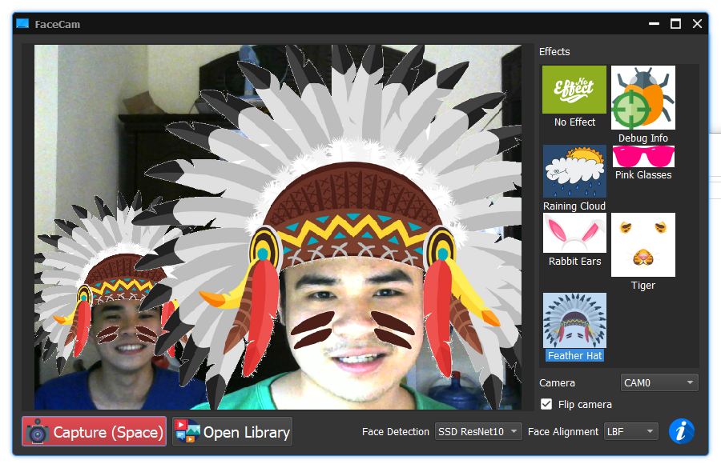

# FaceCam - Funny Camera

A camera desktop application with funny face decorations and filters.

This application is built to try face detection and alignment algorithms in an interesting way.

**Supported Operating Systems:** Currently, we only support Windows and Ubuntu operation system. However, you can also try to build it for other linux distribution and macOS.

**Screenshot:**



## I. DEVELOPMENT ENVIRONMENT AND BUILD

### Requirements:

- CMake >= 3.10
- Qt 5
- OpenCV >= 4.0.1
- C++ 17 compiler

### Setup for Linux - Ubuntu 18.04

#### Setup

- Install QT:

```
sudo apt-get install build-essential
sudo apt-get install qtcreator
sudo apt-get install qt5-default
sudo apt-get install qt5-doc
sudo apt-get install qt5-doc-html qtbase5-doc-html
sudo apt-get install qtbase5-examples
sudo /sbin/ldconfig -v
```

- Install OpenCV

```
https://linuxize.com/post/how-to-install-opencv-on-ubuntu-18-04/
```

- Install SDL2 lib
```
sudo apt-get install libsdl2-dev
```

#### Compile and Run

- Compile
```
cd <project directory>
mkdir build
cd build
cmake ..
make
```

- Run
```
./ml-cam
```

### Setup for Windows 10

#### Setup

**NOTE:** You need to correct following paths correctly as your installation.

- Visual Studio 2017

- Install CMake for Windows: https://cmake.org/download/

- Install Gitbash (Optional)

- Install QT: 
    Download and install from this link: https://www.qt.io/download

    + Add QT to PATH:
        C:\Qt\5.12.1\msvc2017_64\bin\

    + Add some environment variables:
        QT_DIR=C:\Qt\5.12.1\msvc2017_64
        QT_QPA_PLATFORM_PLUGIN_PATH=C:\Qt\5.12.1\msvc2017_64\plugins\platforms\

- Compile and install OpenCV 4
    + Add OPENCV_DIR=C:\OpenCV\x64\vc15\staticlib

- Install SDL Lib and add it to PATH: [https://trenki2.github.io/blog/2017/06/02/using-sdl2-with-cmake/](https://trenki2.github.io/blog/2017/06/02/using-sdl2-with-cmake/)
    + Download the development package SDL2-devel-2.0.5-VC.zip and extract it to some location on your hard disk
    + Set SDL2_DIR to the location where you extracted the SDL2 development package.
    + Create a file sdl2-config.cmake where you extracted the development libraries with following content:
```cmake
set(SDL2_INCLUDE_DIRS "${CMAKE_CURRENT_LIST_DIR}/include")
# Support both 32 and 64 bit builds
if (${CMAKE_SIZEOF_VOID_P} MATCHES 8)
  set(SDL2_LIBRARIES "${CMAKE_CURRENT_LIST_DIR}/lib/x64/SDL2.lib;${CMAKE_CURRENT_LIST_DIR}/lib/x64/SDL2main.lib")
else ()
  set(SDL2_LIBRARIES "${CMAKE_CURRENT_LIST_DIR}/lib/x86/SDL2.lib;${CMAKE_CURRENT_LIST_DIR}/lib/x86/SDL2main.lib")
endif ()

string(STRIP "${SDL2_LIBRARIES}" SDL2_LIBRARIES)
```

- **Restart the computer**.

#### Compile and Run

- Use PowerShell:
```
cd <project directory>
mkdir build-win
cd build-win
cmake -G "Visual Studio 15 2017 Win64" ..
```

- Open `build-win\ml-cam.sln` with Visual Studio 2017.

- Set `ml-cam` as StartUp project. (Right click `ml-cam` project > Set as StartUp project)

- Right click `ml-cam` project > **Properties** > **Configuration Properties** > **C/C++** > **Code Generation** >  Set **Runtime Library** to `Multi-threaded (/MT)`. **You need to check this option again after changing the build mode (debug/release)**.

- Set Working Directory in Debugging to TargetDir: Right click `ml-cam` project > **Properties** > **Configuration Properties** > **Debugging** > Set **Working Directory** to `$(TargetDir)`. 

- Build project with Visual Studio 2017.

- Deploy QT dlls:

    + For Release Build
    ```
    cd build-win\Release
    windeployqt.exe --release  .\ml-cam.exe
    ```

    + For Debug Build
    ```
    cd build-win\Debug
    windeployqt.exe --debug  .\ml-cam.exe
    ```

- **NOTE**:
    + If you build with Release mode, `cd build-win\Release`.
    + Only after you run `windeployqt.exe  .\ml-cam.exe` successfully, you can run the excutable file `ml-cam.exe`.


## II. NOTE FOR DEVELOPERS

### Bug of `QString::fromStdString()`

- To convert std::string to QString, the following way causes an error on Windows:

```
QString::fromStdString(string_to_convert);
```

Instead, Use `QString::fromUtf8` like this:
```
QString::fromUtf8(string_to_convert.c_str());
```


## III. REFERENCES / CITE

- In this project, we use code from:
    + Dark Theme for Qt5 by Juergen Skrotzky: [https://github.com/Jorgen-VikingGod/Qt-Frameless-Window-DarkStyle](https://github.com/Jorgen-VikingGod/Qt-Frameless-Window-DarkStyle).
    + Image viewer from [https://github.com/easymodo/qimgv](https://github.com/easymodo/qimgv).

- Images, icons from:
    + https://www.flaticon.com/authors/smashicons
    + https://www.flaticon.com/authors/roundicons
    + https://www.freepik.com/free-vector/bunny-ears-nose-carnival-mask-photo_4015599.htm
    + and other images collected from the internet.